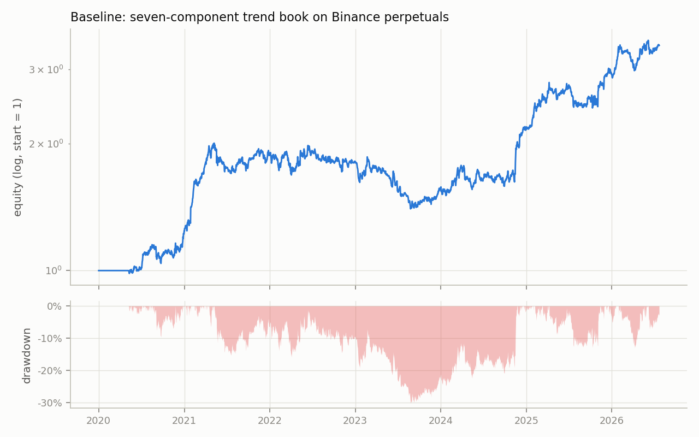
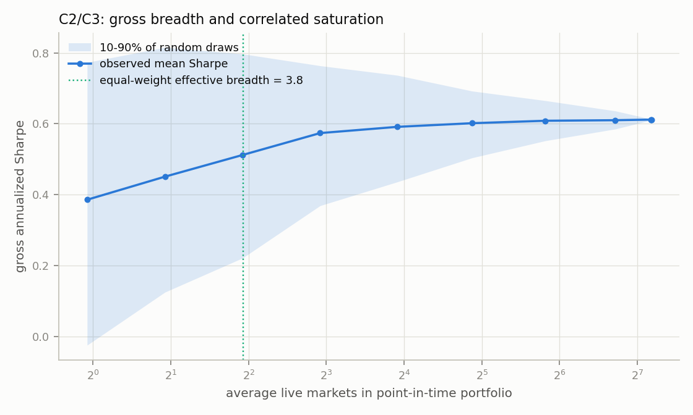
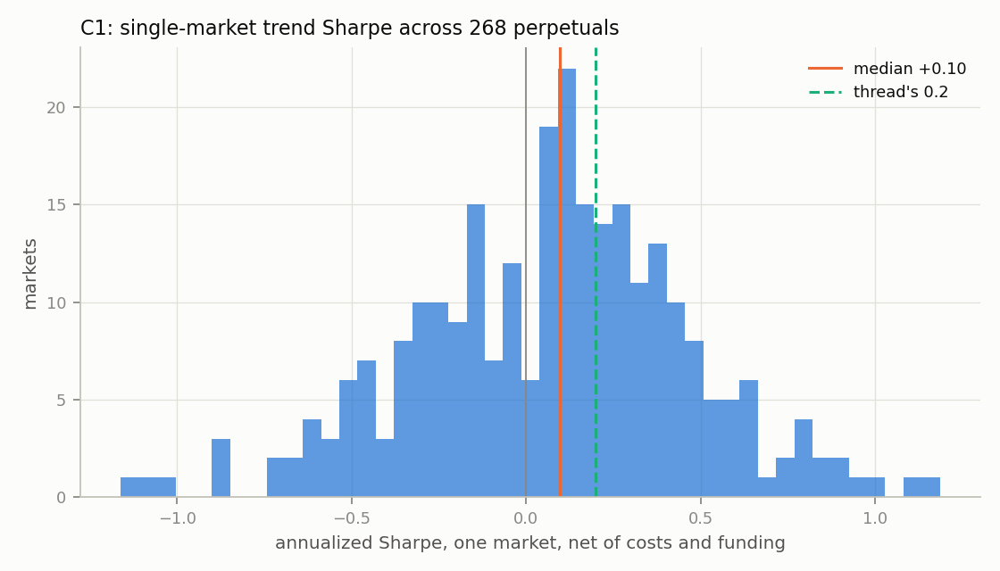
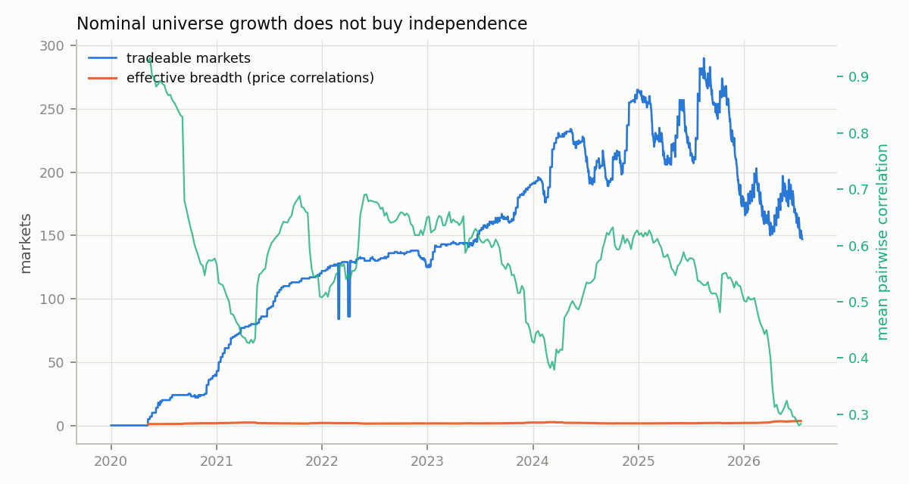
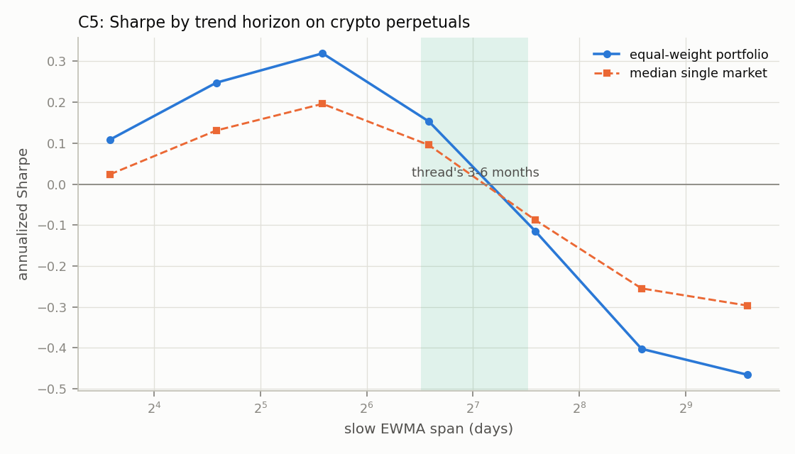
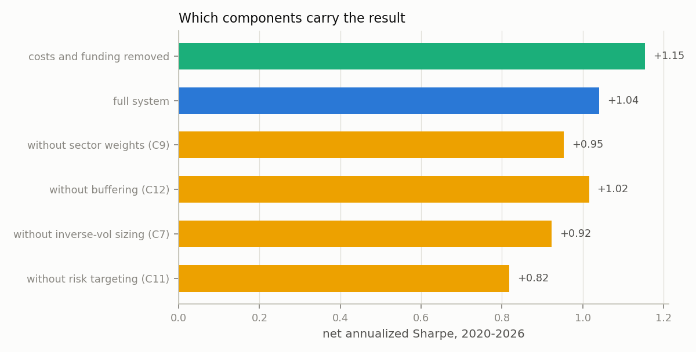
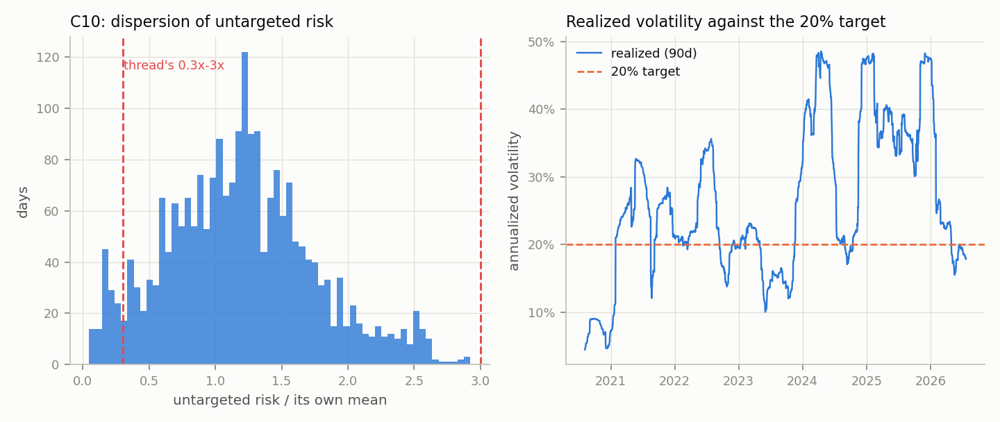
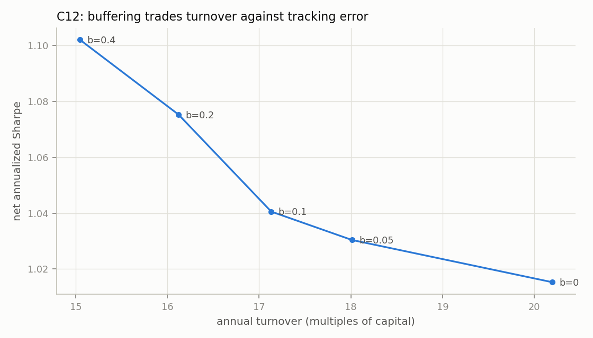

# A CTA Trend-Following System on Binance Perpetuals

This repository turns a public seven-component trend-following construction
into a complete Binance USDT-perpetual backtest. The source is the
[November 2022 thread](https://x.com/i/web/status/1587591552691765251).
The exercise checks both the published construction and its empirical claims.

Sections 1-8 freeze the rule set before any result is computed. Sections
9-12 report measurements. [SOURCE.md](SOURCE.md) states what the thread
does and does not publish; every number below that the thread does not
supply is marked **[choice]**.

---

## 1. Scope

The source names seven components and gives a conventional design for each.
All seven appear here, but the test venue differs from the cross-asset
setting in the source.

| # | Component | Thread's prescription |
|---|---|---|
| 1 | Universe selection | as many *diversifying* markets as possible |
| 2 | Trend detection | fast MA minus slow MA of log price, normalized by volatility |
| 3 | Signal to position | saturating response: sigmoid, or `x*exp(-x^2)` |
| 4 | Sector weights | equalize long-run risk across asset-class groups |
| 5 | Portfolio risk targeting | scale the book to a volatility target |
| 6 | Trading rules | buffering, to trade only when far from target |
| 7 | Execution | model commissions and slippage honestly |

The thread's setting is 60-400 cross-asset futures. This project has 788
crypto perpetuals, which is a large nominal universe inside a *single*
asset class. The diversification measurements separate nominal market count
from independent breadth throughout.

## 2. Data

| | |
|---|---|
| Universe | 788 USDT-quoted perpetuals, every contract with published archives, delisted included, stablecoin bases excluded |
| Bars | hourly klines 2020-01-01 to 2026-07-22, resampled to daily UTC |
| Funding | monthly `fundingRate` archives, complete published history |
| Source | `data.binance.vision`, mirrored locally; see `TREND_MIRROR_DIR` |

Daily bars are built from hourly bars: open of the first hour, close of the
last, max high, min low, summed volume and quote volume. A day with fewer
than 20 of 24 hourly bars is marked incomplete and is not tradeable
**[choice]**; its return is still carried so a position held through it is
marked correctly.

Delisted contracts remain in the panel until their archives stop. When the
next open is missing, the position is marked to the latest observable close,
then frozen at that mark until observations resume. Archive exhaustion alone
does not imply that the prior close was an executable liquidation: the
position remains frozen unless an open resumes. Only positions executable at
the predeclared backtest endpoint are liquidated at that day's close.

## 3. Frozen rule set

All parameters below are **[choice]**s unless quoted from the thread.
Rationale is given where a defensible alternative exists.

### 3.1 Timing convention

Daily rebalance at 00:00 UTC. Signals use bars strictly through the
previous day's close. Fills are at the current day's open. A position set
at open *t* earns `open(t+1)/open(t) - 1`. No information used at time *t*
is unavailable at 00:00 UTC on day *t*.

### 3.2 Point-in-time universe filter

A symbol is tradeable on day *t* when, using data through *t-1*:

- at least 120 complete daily bars of history;
- trailing 30-day median daily quote volume at least $5,000,000;
- a complete bar on *t-1* and a bar present on *t*.

The volume floor is the one component with no analogue in the thread
(futures CTAs pick markets by hand). It exists because a $50k/day
perpetual cannot absorb a vol-targeted position at any account size.

This rolling selection, with delisted contracts kept to their last
archive, also follows the December 2022 "backtest errors" series. Its first
entry covers universe
look-ahead ([S3 in docs/source-supplements.md](docs/source-supplements.md)).

### 3.3 Volatility forecast (component 3 sizing input)

Thread: *"a blend of a steady-state long term volatility (estimated over 10
years) and a short-term realized volatility (eg 30-60 days)"*.

$$
\hat\sigma_{i,t}=\max\!\left(\;0.70\,\sigma^{\mathrm{ST}}_{i,t}+0.30\,\sigma^{\mathrm{LT}}_{i,t},\;\;\sigma_{\min}\right)
$$

- $\sigma^{\mathrm{ST}}$: standard deviation of the last 60 daily log
  returns (thread's "30-60 days"; 60 chosen as the more stable end).
- $\sigma^{\mathrm{LT}}$: expanding-window standard deviation over all
  history available at *t*, capped at the last 10 years. The archive is
  6.5 years deep, so this is an expanding estimate in practice, a
  **labeled deviation** forced by the venue's age.
- Weights 0.70/0.30: the standard practitioner blend; the thread gives none.
- $\sigma_{\min}$ = 20% annualized, a floor that stops pegged or stalled
  contracts from demanding unbounded leverage.
- Annualization uses $\sqrt{365}$; perpetuals trade every day.

### 3.4 Trend signal (component 2)

Thread: *"a fast moving average of (log) price minus a slow moving average,
probably normalized by volatility"*, on horizons *"from 1 month to 1 year,
with an average around 3-6 months"*.

Three exponentially-weighted crossover speeds, spans in days:

$$
(S_k,L_k)\in\{(16,48),\;(32,96),\;(64,192)\}
$$

The slow spans are 1.6, 3.2 and 6.3 months, centering the ensemble on the
thread's stated 3-6 month average. A commonly published three-speed set is
one octave faster; the shift here is deliberate and labeled.

For each speed, with $p=\log(\text{close})$ and $\sigma^d$ the daily
volatility forecast of 3.3:

$$
y_{k,i,t}=\frac{\mathrm{EWMA}_{S_k}(p)-\mathrm{EWMA}_{L_k}(p)}{\sigma^d_{i,t}\sqrt{L_k}},
\qquad
z_{k,i,t}=\frac{y_{k,i,t}}{\mathrm{sd}_{365}(y_{k,i,\cdot})}
$$

The first division is the thread's "normalized by volatility" and makes the
signal dimensionless. The second is a trailing 365-day (minimum 60
observations) rescaling to unit variance so the three speeds enter the
average with equal risk weight rather than equal nominal weight. Both use
only past data. The combined signal is

$$
z_{i,t}=\frac{1}{|K_{i,t}|}\sum_{k\in K_{i,t}}z_{k,i,t},
$$

clipped to $[-6,6]$ for numerical safety only; the response function
saturates far below that. A speed whose slow span is not yet filled drops
out of the average, so a young symbol trades on its faster speeds alone
until the slow ones become available.

### 3.5 Response function (component 3)

Thread: *"a sigmoid function (left) or a function like x * exp(-x^2) which
reduces the target position for very large values of the trend signal"*.

Baseline **[choice]**: $f(z)=\tanh(z)$, the sigmoid branch, capped at
$\pm1$.

First-class alternatives, reported side by side rather than selected on:

| Name | $f(z)$ |
|---|---|
| `tanh` (baseline) | $\tanh z$ |
| `overextension` | $z e^{-z^2/4}\,/\,(\sqrt2 e^{-1/2})$, peak 1 at $z=\sqrt2$ |
| `linear` | $\mathrm{clip}(z,-1,1)$ |
| `binary` | $\mathrm{sign}(z)$ |

The thread also mentions adding a long bias for markets expected to rise
on average but does not favor it. It is not implemented: there
is no crypto analogue of an equity risk premium that is knowable ex ante.

### 3.6 Unscaled target exposure (components 3, 4)

$$
u_{i,t}=f(z_{i,t})\cdot\frac{g_{c(i),t}}{\hat\sigma_{i,t}}
$$

so that, before sector weights, every market at full signal contributes the
same risk, matching the thread's *"inversely proportional to a market-specific
volatility forecast ... each market contributes equally to risk"*.

**Sector weights $g$** implement *"bucket up the universe into broad asset
class groups, and try and have roughly equal volatility from each asset
class in the long run"*. Crypto has no exogenous sector taxonomy that is
stable and point-in-time, so groups are discovered from returns:

- every 7 days **[choice]**, take the trailing 180-day return matrix of
  tradeable symbols;
- correlations centered and standardized separately on each pair's shared
  observations, shrunk 30% toward the constant-correlation matrix, then
  eigenvalue-projected and renormalized to a positive-semidefinite
  correlation matrix;
- average-linkage hierarchical clustering on $d=\sqrt{2(1-\rho)}$, cut into
  $K=8$ clusters **[choice]**;
- with $q_i=1/\hat\sigma_i$ at full signal, compute each active cluster's
  standalone pre-sector risk
  $R_c=\sqrt{q_c^\top\Sigma q_c}$; set $g_c\propto1/R_c$, normalized to
  mean 1 across active symbols. Thus every cluster has equal standalone
  full-signal risk regardless of its market count or internal correlation.

Ablation `no_sector` fixes $g\equiv1$ and isolates what component 4 adds.

Only symbols carried by the current correlation estimate may hold exposure,
so the ex-ante volatility of section 3.7 covers every position in the book
rather than a subset of it. A newly eligible symbol waits at most seven days
before it can be traded.

### 3.7 Portfolio risk targeting (component 5)

$$
m_t=\frac{\sigma^{\mathrm{target}}}{\sqrt{u_t^{\top}\Sigma_t u_t}},
\qquad
N^{*}_{i,t}=m_t\,u_{i,t}\,E_t
$$

with $\sigma^{\mathrm{target}}=20\%$ annualized (the number the thread uses
in its own example), $\Sigma_t$ the same shrunk weekly covariance, and
$E_t$ current equity. Gross notional is then capped at
$2\times E_t$ **[choice]**, scaling all positions pro rata if breached.
That cap is a perpetual-futures margin reality with no counterpart in the
thread.

$m_t$ is unbounded because $u$ is a notional-per-dollar weight whose scale
depends on the number of live markets. The gross leverage cap is the hard
portfolio bound.

An account whose equity reaches zero is recorded as **ruined**: it stops
trading and every later day is reported flat. No run is floored at a
positive equity to keep a return series alive.

Ablation `no_target` replaces $m_t$ with a constant calibrated so its
average post-buffer ex-ante risk matches the targeted run during the design
period ending 2023-12-31. The constant is then frozen for the held-out
period. Its daily post-buffer risk divided by $\sigma^{\mathrm{target}}$ is
the direct test of claim C10 ("0.3x to 3x").

### 3.8 Trading rule (component 6)

Buffering. With $\tau_{i,t}=b\cdot m_t\,\frac{E_t}{\hat\sigma_{i,t}}$ the
notional value of $b$ units of the market's own risk allocation:

- if $`|N_{i,t}-N^{*}_{i,t}|\le\tau_{i,t}`$, do not trade;
- otherwise trade to the near edge, $`N^{*}_{i,t}\pm\tau_{i,t}`$.

Baseline $b=0.10$ **[choice]**. Swept over $\{0,0.05,0.10,0.20,0.40\}$ to
produce the turnover-versus-net-return curve that claim C12 asserts exists.
The thread's refinements (widening the buffer when spreads are wide, and
partial fills toward target for large books) are not implemented; the
archive has no spread data and the capacity question is out of scope.

### 3.9 Costs (component 7)

- **Trading**: 10 bps of traded notional **[choice]**, being 5 bps taker
  fee plus 5 bps slippage. Swept over $\{2,5,10,20\}$ bps.
- **Funding**: measured, not assumed. Each funding timestamp charges
  $r_{\text{funding}}\times N_{i}$ against a long and credits a short,
  using the contract's own published rate and interval. Payments are
  bucketed by the calendar day they stamp, so the 00:00 UTC payment lands
  on the position set at that day's open rather than the one held into it,
  a one-payment boundary approximation. Symbols or months
  with no published archive are charged zero funding, which is optimistic
  and is reported as a coverage fraction.
- No borrow, margin-interest or liquidation modeling. Positions are
  notional; the 2x gross cap is the only leverage constraint.

### 3.10 Accounting

One compounding equity account starting at $100{,}000$. Daily P&L is
$\sum_i N_{i,t}\,r_{i,t}$ minus trading cost and funding, where
$r_{i,t}=\mathrm{open}_{i,t+1}/\mathrm{open}_{i,t}-1$. Sharpe ratios are
annualized from daily returns with $\sqrt{365}$ and are computed on
arithmetic daily returns of the equity curve.

When the next open is missing, $r_{i,t}$ first marks the position from the
current open to the current close without inventing a liquidation. That close
is carried during the missing-open interval, and the remaining cumulative
return is realized when an open resumes. Only positions with an executable
price on the predeclared final backtest day are closed and charged closing
turnover. Drawdown includes the initial account value as its first high-water
mark.

## 4. Claims under test

Restated from [SOURCE.md](SOURCE.md) with the statistic each maps to.

| # | Claim | Statistic |
|---|---|---|
| C1 | single-market trend Sharpe $\approx$ 0.2 | distribution of per-symbol standalone Sharpe |
| C2 | Sharpe scales like sqrt(independent breadth) | effective breadth $1/(w^\top Rw)$ and point-in-time N-market diagnostics |
| C3 | universe expansion worth 1.5-2x Sharpe | ratio of large-N to small-N Sharpe |
| C4 | correlated additions add little | correlation and breadth within/across clusters |
| C5 | practitioners use 1-12 month horizons, averaging 3-6 | performance diagnostic per crossover speed |
| C6 | saturating responses are common | implementation check and response sensitivity |
| C7 | inverse-vol sizing is common | implementation check and equal-notional sensitivity |
| C8 | simple volatility forecasts capture most benefit | comparison among simple forecasts; no oracle claim |
| C9 | sectors can be equalized for diversification | cluster-risk invariant and `no_sector` sensitivity |
| C10 | untargeted risk spans 0.3x-3x | quantiles of ex-ante vol / target |
| C11 | risk targeting improves Sharpe | full system vs `no_target` |
| C12 | buffering keeps positions near target and cuts turnover | turnover, target tracking error and net Sharpe vs $b$ |

## 5. Evaluation protocol

- Full sample 2020-01-01 to 2026-07-22, split into a design period through
  2023-12-31 and a disjoint held-out period beginning 2024-01-01. The
  no-target control is calibrated on the design period only; every other
  parameter is fixed before either period is measured.
- Every variant runs on identical dates, universe, costs and timing. Only
  the named component changes.
- Reported per run: gross and net annualized return, annualized
  volatility, Sharpe, max drawdown, turnover, average gross exposure,
  cost decomposition, and long/short attribution.
- Sharpe differences between variants are reported with a stationary
  bootstrap on the daily return difference (mean block 21 days, 2000
  resamples), because the variants share the same market paths and their
  differences are strongly autocorrelated.

## 6. Pre-analysis invariants

- Signal, volatility, correlation, cluster and universe membership use
  data strictly before the fill.
- Missing bars never become favorable fills; a symbol without a bar is not
  tradeable that day.
- Delisted contracts stay in the panel to their last archive.
- The correlation and cluster estimates are rebuilt on a fixed weekly
  cadence, never conditioned on outcomes.
- Sweeps in section 10 are diagnostics of the claims. The baseline
  reported in section 9 is the one frozen here, whether or not a swept
  cell beats it.
- The freeze-before-measuring discipline also appears in the March 2021
  supplement, which builds a convincing backtest on pure
  random noise to show what in-sample parameter choice does
  ([S1 in docs/source-supplements.md](docs/source-supplements.md)).
- Funding coverage is reported as a fraction. Uncovered exposure is charged
  zero, which flatters the result.

## 7. Known limitations before running

- Open-to-open execution with a flat cost model; no book, queue or impact.
- Daily rebalancing cannot see an intraday short squeeze: a position is
  marked open-to-open, so a pump-and-retrace inside the day is invisible
  and the liquidation it would have forced is not modeled. The supplementary
  evidence describes a switch to 5-minute rebalancing after a 20x intraday
  pump
  ([S4 in docs/source-supplements.md](docs/source-supplements.md)).
  Section 13 measures the associated position-sizing defense.
- No capacity analysis. A 2x-gross vol-targeted book across 500 alt
  perpetuals is not executable at institutional size, and no claim is made
  that it is.
- Single venue, single quote currency, single asset class.
- No margin, liquidation or exchange-risk modeling.
- The volatility floor, gross cap and volume floor are structural choices
  that a different implementer would set differently.

## 8. Running it

```bash
python -m pip install -r requirements.txt
make test        # 38 synthetic unit tests, no archive needed
make funding     # one-off: fetch the full fundingRate history into the mirror
make panel       # daily panel + funding panel from the mirror
    make backtest    # baseline, ablations, sweeps -> results/runs.csv
    make ccxt-backtest # exploratory recent Binance USD-M backtest via CCXT
    make app         # configurable interactive dashboard at localhost
make claims      # C1-C12 measurement -> results/claims.json
make report      # figures and results/report.md
```

`make all` runs panel, backtest, claims and report in order. The run is
deterministic: repeating it reproduces the baseline Sharpe to four decimals.

`TREND_MIRROR_DIR` points at the archive mirror and defaults to
`./data/mirror`, so a fresh clone runs with no path editing. `make funding`
is the only step that writes into the mirror; nothing else writes outside
the project directory.

---

## 9. Baseline result

The frozen rule set runs from 2020-01-01 to 2026-07-22. The first trade is
on 2020-05-08, once the earliest contracts clear the 120-day history gate
and the risk model has a correlation estimate.



| | Full sample | Design (through 2023) | Held out (2024-) |
|---|---|---|---|
| Net annualized Sharpe | **1.04** | 0.68 | 1.54 |
| Gross Sharpe | 1.15 | | |
| Total return | +242.1% | | |
| CAGR | +20.6% | | |
| Realized volatility | 19.91% | | (20% target) |
| Max drawdown | -30.1% | | |

| | |
|---|---|
| Average tradeable markets | 143 (15 in 2020, 238 in 2025) |
| Average held ex-ante volatility | 19.49% |
| Average gross exposure | 0.42x equity |
| Peak gross exposure | 1.22x equity (below the 2x cap) |
| Annual turnover | 17.1x capital |
| Trading cost drag | 1.71%/yr at 10 bps |
| Funding cost drag | 0.01%/yr, measured on 98.7% of tradeable symbol-days |
| Long / short P&L split | +$189k / +$75k |

The risk target works in aggregate, but performance is regime-dependent:
the held-out Sharpe is materially higher than the design-period Sharpe and
the full-sample drawdown reaches 30%. The run shows that the construction
operates as specified on this venue. It does not establish a stationary
Sharpe-1 process.

Removing trading costs and funding lifts Sharpe from 1.04 to 1.15. Trading
cost is the larger measured drag in this run.

## 10. Claim-by-claim measurements

Full tables in [results/report.md](results/report.md).

| # | Source statement | Current measurement | Interpretation |
|---|---|---|---|
| C1 | single-market Sharpe around 0.2 | median +0.17 gross, +0.10 net over 268 established markets | consistent on a gross basis |
| C2 | Sharpe scales with $\sqrt{\text{independent breadth}}$ | equal-weight strategy-return breadth 3.81 across 268 streams | conditional identity; nominal count is not breadth |
| C3 | broader cross-asset universe can add 1.5-2x Sharpe | gross Sharpe changes 1.01x from 64 to 290 eligible crypto markets | venue does not supply comparable independent breadth |
| C4 | uncorrelated additions help more | 8 cross-cluster markets provide breadth 6.22 vs 2.75 in-sample and 3.23 vs 2.34 out-of-sample | supported, with weaker cluster separation out of sample |
| C5 | typical horizons are 1-12 months, averaging 3-6 | crypto diagnostic peaks at a 48-day slow span | practice statement; performance optimum is venue-specific |
| C6 | saturating responses are common | tanh 1.04; overextension 0.87; linear 1.03; sign 1.15 | implementation sensitivity, not a test of industry practice |
| C7 | inverse-volatility sizing is common | 1.04 vs 0.92 equal-notional; CI for difference excludes zero | inverse-vol helps this implementation |
| C8 | simple volatility forecasts capture most benefit | blend 1.04; short 1.10; long 0.88; EWMA 1.07 | simple variants measured; no complex-oracle comparison |
| C9 | sectors can be risk-equalized | exact cluster-risk invariant; +0.09 Sharpe vs no-sector, wide CI | portfolio construction works; return effect is undetected |
| C10 | untargeted risk can span 0.3x-3x target | 0.05x-2.92x, with 5.7% of days outside that band | similar upper scale, materially lower downside |
| C11 | risk targeting improves Sharpe | 1.04 vs 0.82 at design-risk-matched scale; CI [-0.05,+0.51] | positive estimate, not statistically resolved |
| C12 | buffering reduces turnover while staying near target | 20.2x to 15.0x turnover; tracking error 0.4%-10.1% of equity | supported trade-off |

### Independent breadth, not listing count



Across 268 perpetuals with at least two calendar years after first
eligibility, the standalone strategy has median Sharpe +0.17 gross and
+0.10 net. The net cross-section is broad: its 10th and 90th percentiles are
-0.45 and +0.54, and 60% of markets are positive.



The breadth curve reports gross returns from point-in-time portfolios.
Each random-priority draw assigns symbols a fixed random priority and holds
the first N currently available markets. No future listing or survival
information selects a constituent. No unmodeled constituent-turnover cost is
presented as net performance. Gross Sharpe reaches about 0.58 by eight slots
and is essentially flat beyond 32; moving from 64 to the maximum 290 eligible
markets changes it by less than 1%. Square-root scaling applies to
*independent* breadth, not nominal slots.

For equal weights $w$, the variance-equivalent independent breadth is
$B=1/(w^\top Rw)$. The 268 established strategy-return streams have mean
pairwise correlation 0.26 and $B=3.81$. The weekly price risk models average
153 markets, mean correlation 0.57 and breadth 1.82. Those are the quantities
that govern diversification; the 788-contract listing count does not.



Clustering on the full record illustrates C4 mechanically: eight markets
drawn across clusters have average correlation 0.04 and breadth 6.22,
against correlation 0.28 and breadth 2.75 inside one cluster. A stricter
test clusters only on pre-2023 returns and scores post-2023 correlations.
There the eight-market breadth advantage is 0.88 and the 16-market advantage
is 0.20. Correlation diversification persists, although the historical
cluster map separates future returns much less strongly than it separates
the sample on which it is built.

The liquidity sweep shows the capacity trade-off: raising the volume floor
from $5M to $100M/day reduces Sharpe from 1.04 to 0.58 by concentrating the
book in the most liquid, correlated contracts.

### Horizons run faster than the thread's



This crypto performance diagnostic peaks at a 48-day slow span (1.6 months)
with portfolio Sharpe 0.32. The 96- and 192-day cells score 0.16 and -0.11;
the 384- and 768-day cells score -0.40 and -0.47. The source's 3-6 month
statement describes practitioners' average horizons, not a universal
optimum. The sweep is reported
as sensitivity analysis and does not select a replacement baseline.

### Component sensitivity and risk control



Paired stationary-bootstrap intervals on Sharpe(variant) - Sharpe(baseline):

| Component removed | Sharpe | $\Delta$ vs baseline | 95% CI |
|---|---|---|---|
| Risk targeting (C11) | 0.82 | -0.22 | [-0.51, +0.05] |
| Inverse-vol sizing (C7) | 0.92 | -0.12 | [-0.21, -0.04] |
| Buffering (C12) | 1.02 | -0.03 | [-0.11, +0.06] |
| Sector weights (C9) | 0.95 | -0.09 | [-0.82, +0.64] |
| Costs and funding | 1.15 | +0.11 | [+0.02, +0.21] |

The no-target multiplier is calibrated only on 2020-2023 to match the
baseline's average post-buffer ex-ante risk, then frozen. Over the full
sample it realizes 27.3% volatility against 19.9% for the targeted book and
draws down 43.1% against 30.1%. Its Sharpe is lower by 0.22, but the paired
interval crosses zero, so C11 is directionally supported rather than
statistically resolved.



C10 uses the fixed book's actual post-buffer ex-ante risk divided by the 20%
target. The ratio spans 0.05x-2.92x; its 5th, median and 95th percentiles are
0.26x, 1.18x and 2.24x. Only 5.7% of days lie outside the source's 0.3x-3x
illustrative range, all on the low side.

Inverse-volatility sizing is the only component ablation whose paired
interval excludes zero. Response sensitivity is larger than before sector
risk targeting: tanh and clipped-linear are near 1.04, overextension is
0.87, and binary is 1.15. These are performance diagnostics; the source's
C6 and C7 statements concern common industry construction. The simple
volatility variants range from 0.88 to 1.10 and do not include a complex or
oracle forecast, so C8 remains only partially measurable here.



C12 is visible directly. Increasing the buffer from 0 to 0.4 lowers annual
turnover from 20.2x to 15.0x capital while average absolute target tracking
error rises from 0.4% to 10.1% of equity. Net Sharpe ranges from 1.02 to 1.10;
the differences are not statistically distinguishable. The frozen
$b=0.10$ produces 17.1x turnover and 4.8% average tracking error.

## 11. Reproduction verdict

The seven-component construction is implementable on Binance perpetuals
and produces a full-sample net Sharpe of 1.04 at 19.9% realized volatility.
Its design and held-out Sharpes differ substantially, and its worst drawdown
is 30%, so the full-sample number should not be read as a stable expectation.

The clearest source-consistent result is structural: single-market trend is
weak, and diversification depends on independent return streams rather than
contract count. This venue supplies only 3.8 variance-equivalent independent
strategy streams among 268 established contracts, so nominal-universe
expansion saturates quickly. That observation is consistent with C2 and C4;
it does not falsify a square-root rule whose premise is independence.

Within this implementation, inverse-volatility sizing has a detectable
Sharpe contribution. Risk targeting has the expected sign and controls the
risk distribution, but its Sharpe contribution is not statistically resolved.
Sector risk equalization is exact by construction, while its return effect
is unstable across periods. Buffering provides the stated turnover/tracking
trade-off. Descriptive statements about typical industry horizons and
response functions are preserved as construction guidance rather than
treated as backtest hypotheses.

## 12. Limitations

Everything in section 7 still applies. The measurements add these limits:

- The venue is 6.5 years old, so the long-run volatility estimate is an
  expanding window rather than the thread's ten years. After warm-up, the
  design and held-out measurements cover about 3.7 and 2.6 years.
- Effective breadth is the equal-weight variance equivalent
  $1/(w^\top Rw)$. It is exact for the homogeneous-return square-root
  argument but does not account for heterogeneous expected Sharpes.
- Funding is charged from published archives on 98.7% of tradeable
  symbol-days; the remainder is charged zero, which flatters the result
  slightly.
- The C1 cross-section requires two calendar years after first eligibility,
  so it describes established contracts. The breadth curve instead uses a
  point-in-time random priority and never selects on future availability.
- No capacity analysis. A 0.42x-gross book spread over 145 alt perpetuals
  is not an institutional vehicle at any size the thread has in mind.

## 13. Post-freeze extension: the asymmetric short cap

In July 2026 a supplementary post, written in response to an account of
memecoin shorts caught in an intraday pump, stated a rule the
original thread does not contain: size shorts more tightly than longs,
because a long can lose at most its notional while a short can lose an
unbounded multiple of it. The sizing is explicit: holding a fraction *p*
of gross exposure as margin and requiring survival of an *m*-times pump,
no short should exceed roughly $p/(2m)$ of gross; the worked example
($p=0.2$, $m=10$) gives 2%. The posts are summarized as S4 and S5
in [docs/source-supplements.md](docs/source-supplements.md).

It is implemented as a labeled extension. `max_short_frac_gross` caps each
short at the stated fraction of the day's leverage-capped target gross,
applied to both the target and post-buffer books. The cap is one pass, so a
trimmed short can exceed the same fraction of the final smaller gross. The
baseline remains uncapped.

| Cap per short | Net Sharpe | $\Delta$ vs baseline | 95% CI | Max DD | Design | Held out |
|---|---|---|---|---|---|---|
| none (baseline) | 1.04 | | | -30.1% | 0.68 | 1.54 |
| 10% | 1.09 | +0.05 | [-0.03, +0.12] | -28.7% | 0.74 | 1.57 |
| 5% | 1.09 | +0.05 | [-0.13, +0.22] | -27.7% | 0.82 | 1.46 |
| **2% (source example)** | **1.04** | **-0.00** | [-0.31, +0.31] | -32.0% | 0.83 | 1.34 |
| 1% | 1.00 | -0.04 | [-0.40, +0.33] | -34.0% | 0.84 | 1.25 |

No tested cap has a statistically resolved Sharpe effect. The 2% rule
changes maximum drawdown only slightly and has no resolved Sharpe effect;
tighter caps increasingly tilt the book away from short exposure. Funding
drag rises from 0.01% to 0.84% per year at 2%, because shorts collect
funding on average in this sample.

This daily backtest still cannot observe the intraday pump-and-retrace for
which the rule exists, and it has no liquidation model. The table measures
the ordinary-path cost of the insurance, not its tail-event payoff.

## 14. Disclaimer

Research artifact, not investment advice.
